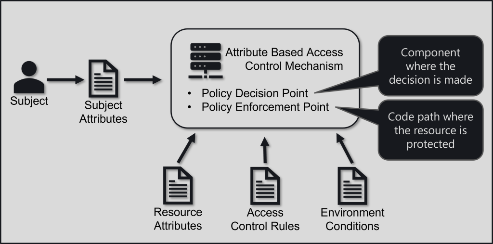
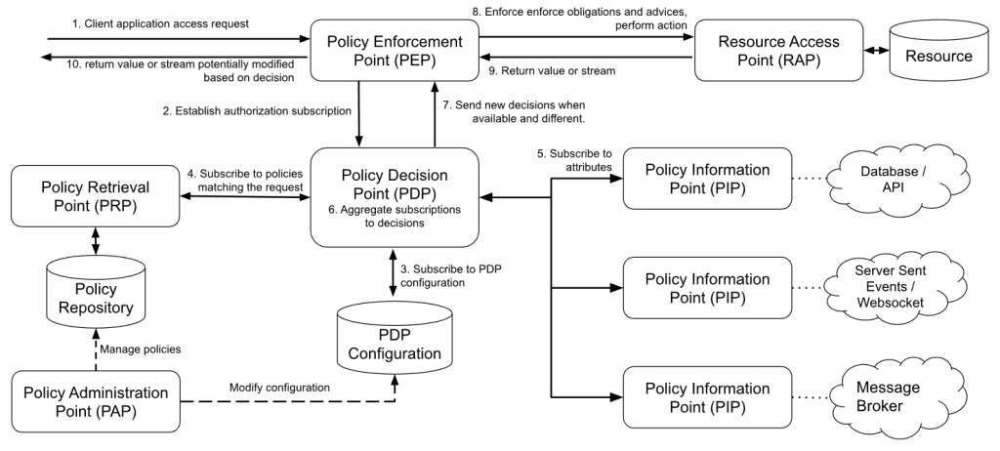

# SAPL Axon Framework Integration

This library supports the implementation of Attribute-based Access Control (ABAC) and Attribute Stream-based Access Control (ASBAC) in applications using the Axon Framework. 

## What is Attribute-based Access Control?

Attribute-based Access Control (ABAC) is an expressive access control model. 
In this tutorial, you will learn how secure services and APIs of a Spring Boot application using the SAPL Engine to implement ABAC. The tutorial assumes basic familiarity with the development process of Spring applications.



ABAC decides on granting access by inspecting attributes of the subject, resource, action, and environment. 

The subject is the user or system requesting access to a resource. Attributes may include information such as the user's department in an organization, a security clearance level, schedules, location, or qualifications in the form of certifications.

The action is how the subject attempts to access the resource. An action may be one of the typical CRUD operations or something more domain-specific like "assign new operator," and attributes could include parameters of the operation.

Resource attributes may include owners, security classification, categories, or other arbitrary domain-specific data.

Environment attributes include data like the system and infrastructure context or time.

An application performing authorization of an action formulates an authorization question by collecting attributes of the subject, action, resource, and environment as required by the domain and asks a decision-making component which then makes a decision based on domain-specific rules which the application then has to enforce.

### The SAPL Attribute-Based Access Control (ABAC) Architecture

SAPL implements its interpretation of ABAC called Attribute Stream-Based Access Control (ASBAC). It uses publish-subscribe as its primary mode of interaction between the individual components. This tutorial will explain the basic ideas. The [SAPL Documentation](https://sapl.io/docs/2.1.0-SNAPSHOT/sapl-reference.html#reference-architecture) provides a more complete discussion of the architecture. 



In your application, there will be several code paths where a subject attempts to perform some action on a resource, and based on the domain's requirements, the action must be authorized. For example, in a zero-trust system, all actions triggered by users or other components must be explicitly authorized. 

A *Policy Enforcement Point (PEP)* is the logic in your application in these code paths that do:
* mediate access to the *Resource Access Point (RAP)*, i.e., the component executing the action and potentially retrieving data 
* formulate the authorization question in the form of an *authorization subscription*, i.e., a JSON object containing values for the subject, resource, action, and possibly the environment. The PEP determines the values based on the domain and context of the current attempt to execute the action.
* delegates the decision-making for the authorization question to the *Policy Decision Point (PDP)* by subscribing to it using the authorization subscription.
* enforces all decisions made by the PDP.

## Maven Dependencies and Project Setup

The SAPL Axon extension currently resides in the ```2.1.0-SNAPSHOT``` version of SAPL. For Maven to be able to download the respective libraries, add the central snapshot repository to the POM:

```xml
    <repositories>
        <repository>
            <id>ossrh</id>
            <url>https://s01.oss.sonatype.org/content/repositories/snapshots</url>
            <snapshots>
                <enabled>true</enabled>
            </snapshots>
        </repository>
    </repositories>
```

SAPL provides a bill of materials module, helping you to use compatible versions of SAPL modules. After adding the following to your POM, future dependencies can omit  the ```<version>``` tag of individual SAPL dependencies:

```xml
    <dependencyManagement>
        <dependencies>
            <dependency>
                <groupId>io.sapl</groupId>
                <artifactId>sapl-bom</artifactId>
                <version>2.1.0-SNAPSHOT</version>
                <type>pom</type>
                <scope>import</scope>
            </dependency>
        </dependencies>
    </dependencyManagement>
```
 
To develop an application using SAPL, the project rquires two components. First, it needs a component for making authorization decisions, the so-called policy decision point (PDP). SAPL supports embedfing the PDP within your application or to use a dedicated server application and delegate the decision-making to this remote service. For an embedded PDP making decisions locally based on policies stored in the application resources. The following dependency is responsible:

```xml
        <dependency>
            <groupId>io.sapl</groupId>
            <artifactId>sapl-spring-pdp-embedded</artifactId>
        </dependency>
```

For connecting to using PDP servers, use ```<artifactId>sapl-spring-pdp-embedded</artifactId>```.


SAPL provides a deep integration with Axon and Spring Security. This integration enables simple deployment of policy enforcement points in Spring application using a declarative aspect-oriented programming style. Add the following dependency to your project:

```xml
        <dependency>
            <groupId>io.sapl</groupId>
            <artifactId>sapl-axon</artifactId>
        </dependency>
```

Finally, the embedded PDP (in its default configuration) requires a folder in the resources ```src/main/resources``` called ```policies```, and a configuration file called ```pdp.json```. To start add the following content to this file: 

```json
{
    "algorithm": "DENY_UNLESS_PERMIT",
    "variables": {}
}
```

The ```algorithm``` property selects an algorithm used to resolve conflicting results from policy evaluation. In this case, the algorithm will ensure that the PDP always returns a ```deny``` decision if no policy evaluation returns an explicit ```permit``` decision. You can use the ```variables``` property to define environment variables, e.g., the configuration of policy information points (PIPs). All policies can access the content of these variables.

## Securing Axon Applications with SAPL

Just like axon itself, SAPL supports the CQRS-ES pattern and it is possible to independently secure access to the comamnd end query side. Hoever, for both sides to be secured, authentication of the users triggereing both commands and queries is a prerequisite. 

### Authentication of Commands and Queries

By default, the SAPL Axon extension will use Spring autoconfiguration to deploy some infrastrcuture code. This includes the ```AuthenticationCommandDispatchInterceptor```and the ```AuthenticationQueryDispatchInterceptor```. 
These ```MessageDispatchInterceptor``` implementations are responsible for adding authentication information to any command or query message before dispatching it to the respective bus. 

These interceptors add the authenticated user to the message metadata. The key to identify the user is ```subject``` and the SAPL extension expects the value to be a valid JSON string. The default implementation uses the default ```ObjectMapper``` deplyed in the application context to write the ```Authentication``` including the ```Principal``` object to this field. It also removes ```credentials``` and ```password```field from the objects before adding the objects to the metadata. 

To customize this behaviour the developer can supply an ```AuthenticationSupplier``` Bean.

### Securing the Command Side

Establishing a Policy Enforcement Point (PEP) for a command is straightforward and only requires the addition of a single ```@PreHandleEnforce```annotation on the method carrying the Axon annotation ```@CommandHandler```, independently if this method resides within an aggregate or in a domain servcie. 

```java
	@CommandHandler
	@PreHandleEnforce
	void handle(HospitalisePatient cmd) {
		apply(new PatientHospitalised(cmd.id(), cmd.ward()));
	}
```

Whenever this annotaiton is present on a ```@CommandHandler```, a PEP is wrapped around the invocation of the command handler. Upon receiving a command, after the potential replay of an aggregate, and before calling the ```handle``` method, this PEP constructs an ```AuthorizationSubscription```, and gets a single ```AuthorizationDecision``` from the Policy Decision Point (PDP). Depending on the decision, i.e., is it ```PERMIT``` or not, the ```handle``` method is invoked, or access is denied. Further, any additional constraints, i.e., obligations or adivice, are attepted to be enforced as well. A failure of enforcing obligations will also result in the PEP to deny access, i.e., it fails the command execution with an ```AccessDeniedException```. 

Whithout further information, the PEP has to make a best-effort to formulate a meaningful authorization subscription based on technical information available. So it will attempt to add all available information about the command and the target aggregate to the subscription. In the case of the command above, this could look like this:

```JSON
{
  "subject": {
    "username": "cheryl",
    "authorities": [],
    "accountNonExpired": true,
    "accountNonLocked": true,
    "credentialsNonExpired": true,
    "enabled": true,
    "assignedWard": "ICCU",
    "position": "DOCTOR"
  },
  "action": {
    "actionType": "command",
    "commandName": "io.sapl.demo.axon.command.PatientCommandAPI$HospitalisePatient",
    "payload": {
      "id": "0",
      "ward": "ICCU"
    },
    "payloadType": "io.sapl.demo.axon.command.PatientCommandAPI$HospitalisePatient",
    "metadata": {
      "subject": "{\"username\":\"cheryl\",\"authorities\":[],\"accountNonExpired\":true,\"accountNonLocked\":true,\"credentialsNonExpired\":true,\"enabled\":true,\"assignedWard\":\"ICCU\",\"position\":\"DOCTOR\"}"
    }
  },
  "resource": {
    "aggregateType": "Patient",
    "aggregateIdentifier": "0"
  }
}
```

To make these authorization questions more domain-specific, and thus the policies to be written closer to the domain's ubiquitous language, developers may customize the the authorization subscription by providing explicit [Spring Expression Language (SpEL)](https://docs.spring.io/spring-framework/docs/3.2.x/spring-framework-reference/html/expressions.html) expressions as parameters in the annotation:

```java
	@CommandHandler
	@PreHandleEnforce(action = "{'command':'HospitalisePatient', 'ward':#command.ward()}", resource = "{ 'type':'Patient', 'id':id, 'ward':ward }")
	void handle(HospitalisePatient cmd) {
		apply(new PatientHospitalised(cmd.id(), cmd.ward()));
	}
```

These SpEL expresseions will make differnt objects available for construction of the authorization subscription. The command will be available as ```#command```, the complete ```CommandMessage``` is available as ```#message```, the metadata map as ```#metadata```, the ```Ececutable``` refering to the handler method as ```#executable``` and the aggregate, or domain service Bean are set as the root object of the SpEL evaluation context and its members and methoda are direclty accessible, if publilc.

In the ecample above, the action SpEL accesses the ```ward()``` method of the command. Also in the resource expression the member variables ```id``` and ```ward``` of the aggregate are directly accessed. Note, that for this to be possible, the respective fields must be ```public```. 

The resulting authorization subscription could look like this:

```JSON
{
  "subject": {
    "username": "cheryl",
    "authorities": [],
    "accountNonExpired": true,
    "accountNonLocked": true,
    "credentialsNonExpired": true,
    "enabled": true,
    "assignedWard": "ICCU",
    "position": "DOCTOR"
  },
  "action": {
    "command": "HospitalisePatient",
    "ward": "ICCU"
  },
  "resource": {
    "type": "Patient",
    "id": "0",
    "ward": "NONE"
  }
}
```

And a matching SAPL policies may look like this:

```
policy "only doctors may hospitalize patients but only into their own wards, system may do it as well"
permit 	action.command == "HospitalisePatient"
where 
  subject == "SYSTEM" || (subject.position == "DOCTOR" && action.ward ==  subject.assignedWard);
```

### Securing the Query Side

The ```@QueryHandler``` methods can be sucrued simmilarly to the command side by adding SAPL annotations. However, for the query side there are four different types of PEPs which correspond to different annotations. Also these annotations behave different, if the query is a normal or a subscription query.

#### Security Annoatrions and Non-Subscription Queries

- ```@PreHandleEnforce```: Established a PEP which constructs the authorization subscription and gets a decision *before* invoking the ```@QueryHandler``` method. 
- ```@PostHandleEnforce```: Established a PEP which constructs the authorization subscription and gets a decision *after* invoking the ```@QueryHandler``` method. This annotation can be used, if the query result is required to construct the authorization subscription. The query result is made available as ```#queryResult``` for SpEL expression in the annotaiton.
- ```@EnforceDropUpdatesWhileDenied```: An annotation typically used for subscription queries. Falls back to the behavior of ```@PreHandleEnforce``` if it encounters a non-subscription query at runtime.
- ```@EnforceRecoverableUpdatesIfDenied```: An annotation typically used for subscription queries. Falls back to the behavior of ```@PreHandleEnforce``` if it encounters a non-subscription query at runtime.

### Security Annotations and Subscription Queries

- ```@PreHandleEnforce```: Established a PEP which constructs the authorization subscription and gets a decision *before* invoking the ```@QueryHandler``` method for the initial query result. If the inital decision of the PDP is *not* ```PERMIT```, access is denied to both the initial result and the updates. If the initial decision  is ```PERMIT```, the initial result is delivered and updates are staring to be delivered until a first decision implying ```DENY``` is sent by the PDP. Then updates are stopped and the query is terminated.
- ```@PostHandleEnforce```: The post invocation idea does not translate well to subscription queries. Access is denied by default. It is suggested to have dedicated queries for subscription ans non-subscription queries if such different PEPs must be implemented.
- ```@EnforceDropUpdatesWhileDenied```: This annotation will not deliver and drop updates when the last known decision is implying ```DENY``` but it will not cancel the query. It will resume sending updates when a new ```PERMIT```decision is sent by the PDP.
- ```@EnforceRecoverableUpdatesIfDenied```: This annotation will not deliver and drop updates when the last known decision is implying ```DENY``` but it will not cancel the query. It will resume sending updates when a new ```PERMIT```decision is sent by the PDP. Additionally, the fact that access is denied wil be sent to the client that it is aware of this facr. This PEP requires the use of the ```SaplQueryGateway``` to send recoverable queries.

The first three PEPs are straight forward and the subscription can be customized using SpEL in the same way as for queries. For the ```@EnforceRecoverableUpdatesIfDenied``` the client application has to do a dew more steps to be able to react on access denied events in the update stream. As Axon terminates a subscription query, whenever an exception is sent, the updates have to be wrapped in a dedicated event and be unwrapped at the client side. Also, the client side has to explicitly signal to the query handling side that the updates must be wrapped.

To do so, the query is sent via tha the ```SaplQueryGateway``` which signals the request to the query sinde and unwraps the updates transparently for the client. The client now can to decide to continue to stay subcribed by using ```onErrorContinue``` on the update ```FLux```.

```java
  @Autowired
  SaplQueryGateway queryGateway;
  
  /* ... */
  
  var result = queryGateway.recoverableSubscriptionQuery(RECOVERABLE_QUERY, queryPayload,
     instanceOf(String.class), instanceOf(String.class), () -> { /* Runnable on deny */});

  result.initialResult().subscribe(this::handleInitialResult);
  result.updates().onErrorContinue((t, o) -> accessDeniedHandler.run()).subscribe(this::handleUpdates);
```

